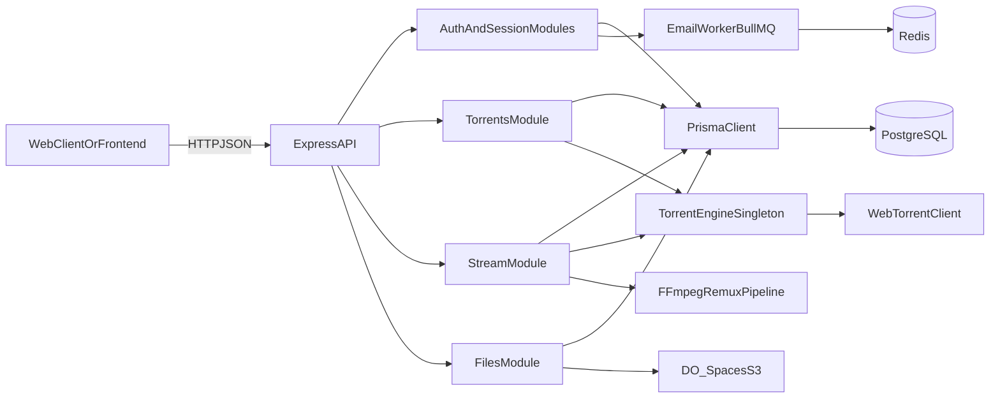
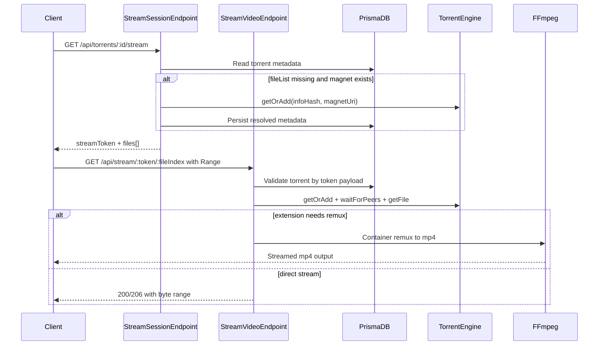

# StreamTorrent Backend

Backend API for StreamTorrent, a web-based torrent streaming platform.
It accepts `.torrent` files or magnet URIs, stores torrent metadata, and streams selected video files through a controlled HTTP pipeline.

## What This Service Owns

- Authentication and session lifecycle (JWT access + rotating refresh tokens)
- 2FA-scoped actions (verify email, reset password)
- File upload/download orchestration via DigitalOcean Spaces
- Torrent ingestion and metadata persistence
- Stateful torrent runtime management (WebTorrent engine)
- Streaming session minting and video delivery with Range support
- Optional remux path for container formats (`mkv`, `avi`, `mov`) via FFmpeg

## Tech Stack

- Runtime: Node.js 20
- Framework: Express 5 (TypeScript, ESM)
- ORM: Prisma + PostgreSQL
- Auth: `jsonwebtoken` + `argon2`
- Validation: Zod
- Torrent Runtime: WebTorrent
- Video Processing: FFmpeg (`fluent-ffmpeg`)
- Storage: DigitalOcean Spaces (S3-compatible)
- Jobs: BullMQ + Redis
- Logging: Pino

## High-Level Architecture



## Runtime Entry Points

- `src/index.ts`: process entrypoint, starts HTTP server and initializes email worker import side effect.
- `src/server.ts`: Express app composition (security middleware, CORS, JSON parser, route mounting, global error handlers).

Request flow is intentionally linear:

1. request enters `server.ts`
2. route-level middleware runs (auth, validation, rate limit)
3. controller maps HTTP input to service calls
4. service executes business logic and data access
5. response is serialized (including `BigInt` safety where needed)

## Layered Design

### 1) Config Layer

- `src/config/env.ts`: central env loading and required-key enforcement.
- `src/config/db.ts`: Prisma singleton.
- `src/config/logger.ts`: Pino singleton with environment-aware log level.

This keeps runtime configuration deterministic and avoids scattered `process.env` usage.

### 2) Module Layer (`src/modules/*`)

Feature-oriented HTTP surface:

- `auth`: register/login/logout/refresh/2FA flows
- `meRoutes`: authenticated profile/session listing
- `files`: upload init/confirm, signed download, soft delete
- `torrents`: `.torrent` upload, magnet ingestion, metadata retrieval
- `stream`: stream session minting + file stream endpoint
- `common`: shared middleware/utilities (`authGuard`, validation, async wrapper, typed errors, global error handling)

Each module follows route -> controller -> service boundaries to keep transport concerns out of business logic.

### 3) Service Layer (`src/services/*`)

Infrastructure and runtime services:

- `services/torrent/torrentEngine.ts`: in-memory torrent lifecycle management
- `services/storage/s3.service.ts`: S3/Spaces abstraction
- `services/mail-service/*`: SMTP + queue worker + templates
- `services/do/spaces.config.ts`: Spaces client initialization

## Core Streaming Architecture

Streaming is split into two endpoints:

- `GET /api/torrents/:id/stream` -> mint short-lived `streamToken` and return file list
- `GET /api/stream/:streamToken/:fileIndex` -> deliver actual media bytes



### Why This Split Matters

- Session endpoint avoids exposing DB internals and creates a controlled short-lived stream capability.
- Video endpoint remains stateless at HTTP level but relies on stateful in-memory `TorrentEngine`.
- Magnet-only torrents can be lazily resolved at stream-session time, reducing up-front cost.

## Torrent Engine Deep Dive

`src/services/torrent/torrentEngine.ts` is a singleton runtime orchestrator.

Responsibilities:

- de-duplicate concurrent loads with a `pending` map
- cap active torrents via `MAX_CONCURRENT_TORRENTS`
- wait for readiness with timeout guards
- expose file selection by validated index
- cleanup idle torrents (`>30 minutes`) every 5 minutes

Operational characteristics:

- stateful in-memory cache
- optimized for single-instance deployment
- horizontal scaling requires shared coordination architecture (not implemented in MVP)

## Security and Reliability Controls

- **Input validation**: Zod schemas on body/query payloads.
- **Auth boundaries**: bearer access token via `authGuard`; scoped 2FA via `twoFactorAuthGuard`.
- **Rate limits**:
  - auth login/refresh
  - torrent upload/magnet endpoints
- **Path traversal defense**: torrent file paths normalized and rejected when absolute or `..`-prefixed.
- **Token separation**: stream token uses dedicated secret and expiry.
- **Streaming safety**: validates `fileIndex` and Range headers.
- **Error normalization**: `HttpError` + global handler ensure predictable API failures.

## Backend Project Structure

```text
streamtorrent-backend/
├── Dockerfile
├── docker-compose.yml
├── package.json
├── prisma/
│   ├── schema.prisma
│   └── migrations/
├── src/
│   ├── index.ts
│   ├── server.ts
│   ├── config/
│   ├── modules/
│   ├── services/
│   └── types/
└── dist/ (build output)
```

### File and Folder Purposes (Short Reference)

- `Dockerfile`: multi-stage production image build, includes FFmpeg.
- `docker-compose.yml`: production-like container run config with memory limits.
- `package.json`: scripts and runtime dependencies.
- `prisma/schema.prisma`: canonical data model and DB provider config.
- `src/index.ts`: application bootstrap.
- `src/server.ts`: middleware and route wiring.
- `src/config/env.ts`: required env loading.
- `src/config/db.ts`: Prisma client singleton.
- `src/config/logger.ts`: structured logging setup.
- `src/modules/common/*`: shared HTTP middleware and error primitives.
- `src/modules/auth/*`: identity/session/2FA APIs.
- `src/modules/files/*`: Spaces-backed file metadata and access APIs.
- `src/modules/torrents/*`: torrent metadata ingestion and lookup.
- `src/modules/stream/*`: stream token/session orchestration and media response.
- `src/services/torrent/torrentEngine.ts`: WebTorrent runtime lifecycle manager.
- `src/services/storage/s3.service.ts`: signed URL and object lifecycle abstraction.
- `src/services/mail-service/*`: queued email delivery pipeline.
- `src/types/*`: type stubs for third-party libraries.

## API Surface (Implemented)

### Auth and Profile

- `POST /auth/register`
- `POST /auth/login`
- `POST /auth/logout`
- `POST /auth/logout-all`
- `POST /auth/refresh`
- `POST /auth/2fa`
- `POST /auth/verify-email`
- `POST /auth/reset-password`
- `GET /me`

### File Management

- `POST /files/init`
- `POST /files/confirm`
- `GET /files/download`
- `DELETE /files/:key`

### Torrent and Streaming

- `POST /api/torrents/upload`
- `POST /api/torrents/magnet`
- `GET /api/torrents/:id`
- `GET /api/torrents/:id/stream`
- `GET /api/stream/:streamToken/:fileIndex`

## Local Setup Guide

### Prerequisites

- Node.js 20+
- PostgreSQL
- Redis
- FFmpeg available on system path

### 1) Install dependencies

```bash
cd streamtorrent-backend
npm install
```

### 2) Configure environment

Create `.env` with all required values used by `src/config/env.ts`, including:

- DB: `DATABASE_URL`
- JWT/Auth: `JWT_SECRET`, `JWT_ACCESS_EXPIRES_MIN`, `JWT_TWO_FACTOR_EXPIRES_MIN`, `REFRESH_EXPIRES_DAYS`
- Stream: `STREAM_TOKEN_SECRET`, `STREAM_TOKEN_EXPIRY`
- Torrent limits: `MAX_CONCURRENT_TORRENTS`, `MAX_TORRENT_SIZE_GB`
- Spaces: `DO_SPACES_KEY`, `DO_SPACES_SECRET`, `DO_SPACES_ENDPOINT`, `DO_SPACES_REGION`, `DO_SPACES_BUCKET`
- SMTP: `SMTP_HOST`, `SMTP_PORT`, `SMTP_USER`, `SMTP_PASS`, `SMTP_FROM`, `SMTP_SECURE`
- Redis: `REDIS_URL`
- CORS: `ALLOWED_ORIGINS`
- Server: `PORT`
- Admin contact (required by current env loader): `ADMIN_EMAIL`, `ADMIN_PASSWORD`

### 3) Run database migrations and generate Prisma client

```bash
npm run prisma:mig
npm run prisma:gen
```

### 4) Start in development

```bash
npm run dev
```

Server listens on `PORT` from environment and exposes health check at `GET /`.

## Build and Run (Without Docker)

```bash
npm run build
npm start
```

## Deployment Guide

### Docker Image

`Dockerfile` uses two stages:

1. **Builder stage**
   - installs dependencies
   - runs `prisma generate`
   - compiles TypeScript to `dist/`
2. **Runtime stage**
   - installs FFmpeg
   - installs production dependencies
   - copies `dist/`, Prisma artifacts, and migrations
   - starts with `npx prisma migrate deploy && node dist/index.js`

Build:

```bash
docker build -t streamtorrent-backend .
```

Run:

```bash
docker run --env-file .env -e PORT=8080 -p 8080:8080 streamtorrent-backend
```

### Docker Compose

`docker-compose.yml` runs the backend with:

- memory reservation/limit
- JSON log rotation
- startup command including `prisma migrate deploy`
- loopback-bound port mapping

Start:

```bash
docker compose up -d --build
```

## Production Notes

- This service is **stateful** because active torrents are held in process memory.
- Prefer single-instance deployment for MVP consistency.
- If scaling beyond one instance, a shared coordination design for torrent state is required.
- Tune memory allocation according to concurrent torrents and expected file sizes.
- Ensure FFmpeg binary remains available in runtime images/environments.

## Observability and Failure Semantics

- Structured logs via Pino (`info`/`warn`/`error`).
- Validation errors return `400` with issue details.
- Domain errors use normalized `HttpError` payloads.
- Unexpected exceptions are surfaced as `500 INTERNAL_SERVER_ERROR`.

## Development Conventions

- Keep module boundaries strict: route/controller/service.
- Avoid direct `process.env` access outside config layer.
- Prefer typed errors (`HttpError`) over ad-hoc `throw new Error`.
- Keep stream and torrent logic in dedicated modules/services, not in generic middleware.
