# StreamTorrent Backend

Node.js + Express API that powers the StreamTorrent platform. Accepts `.torrent` files or magnet URIs, manages torrent lifecycle via an in-memory WebTorrent engine, and streams video content to the browser with HTTP Range support and on-the-fly FFmpeg remuxing.

---

## Table of Contents

- [Architecture Overview](#architecture-overview)
- [Torrent Module](#torrent-module)
  - [Upload Flow](#upload-flow)
  - [Magnet Flow](#magnet-flow)
  - [Metadata Parsing](#metadata-parsing)
  - [Database Model](#database-model)
- [TorrentEngine Service](#torrentengine-service)
  - [Singleton Lifecycle](#singleton-lifecycle)
  - [Torrent Activation](#torrent-activation)
  - [Peer Discovery](#peer-discovery)
  - [Idle Cleanup](#idle-cleanup)
  - [Concurrency & Limits](#concurrency--limits)
- [Stream Module](#stream-module)
  - [Stream Session Flow](#stream-session-flow)
  - [Token Security](#token-security)
  - [Video Delivery Pipeline](#video-delivery-pipeline)
  - [Range Request Handling](#range-request-handling)
  - [FFmpeg Remuxing](#ffmpeg-remuxing)
- [End-to-End Request Flow](#end-to-end-request-flow)
- [Rate Limiting](#rate-limiting)
- [Running Locally](#running-locally)

---

## Architecture Overview

The backend has three main layers that work together to turn a torrent into a streamable video:

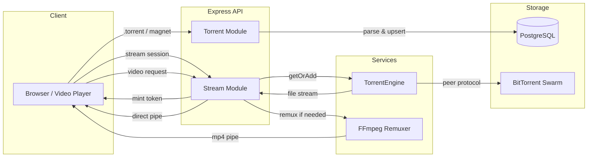

| Layer | Responsibility |
|---|---|
| **Torrent Module** | Accepts user input (`.torrent` file or magnet URI), parses metadata, persists to DB |
| **TorrentEngine** | Stateful singleton managing live WebTorrent instances, peer connections, file access |
| **Stream Module** | Mints short-lived stream tokens, resolves files, pipes video bytes to the client |

---

## Torrent Module

**Location:** `src/modules/torrents/`

Handles ingestion of torrent metadata — no streaming or peer connections happen at this stage.

### Upload Flow

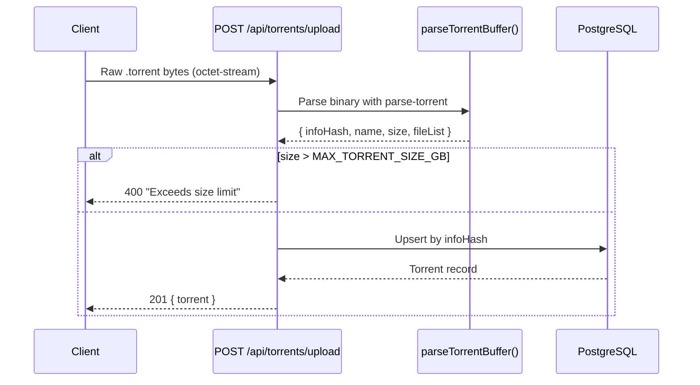

**Key details:**

- The raw `.torrent` binary is stored in the DB (`torrentFile` column, `Bytes` type) so the engine can use it later for faster peer discovery compared to magnet-only records.
- `fileList` is extracted at parse time: an array of `{ path, size, index }` objects stored as JSON.
- Path traversal attacks are prevented: every file path is normalized and rejected if it contains `..` or starts with `/`.
- Upsert semantics: re-uploading a `.torrent` for an existing `infoHash` overwrites `name`, `fileList`, and `torrentFile` only if the new data is richer (e.g., replacing a magnet-only record).

### Magnet Flow

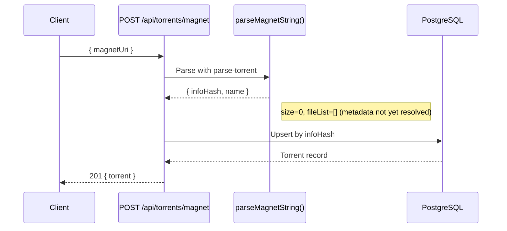

**Key difference from upload:** Magnet URIs carry only the `infoHash` and optionally a display name. The actual file list and size are unknown until the engine connects to peers and downloads the torrent metadata. This resolution happens lazily when a stream session is requested.

### Metadata Parsing

Both flows use the `parse-torrent` library which handles:

| Input | Extracted Fields |
|---|---|
| `.torrent` binary | `infoHash`, `name`, `size`, `files[]` (path + size per file) |
| Magnet URI | `infoHash`, `name` (from `dn=` param), no files or size |

The `torrentTotalLengthToBigInt()` helper safely converts the total size from various types (`number`, `bigint`, `string`) into a PostgreSQL-compatible `BigInt`.

### Database Model

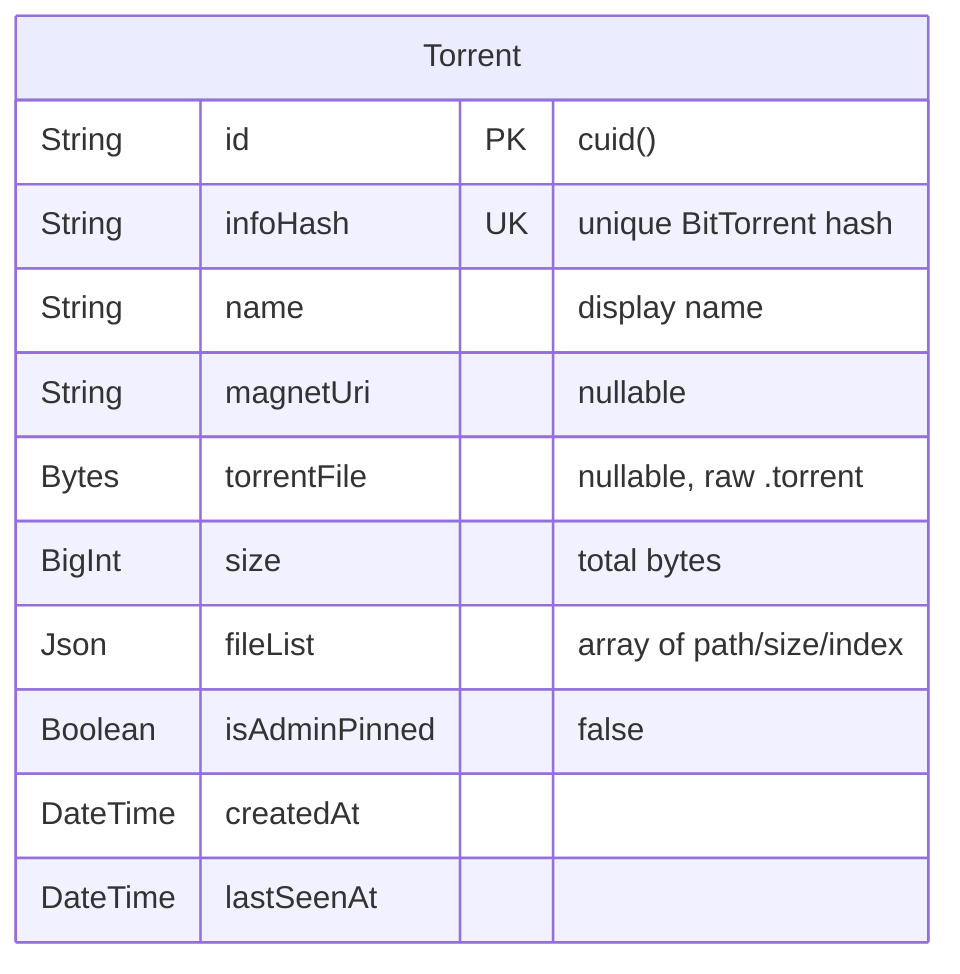

The `infoHash` serves as the natural key: regardless of whether the torrent was added via upload or magnet, identical content produces the same hash, enabling deduplication.

---

## TorrentEngine Service

**Location:** `src/services/torrent/torrentEngine.ts`

A singleton class wrapping a single `WebTorrent` client instance. All active torrents share this client, which manages peer connections, piece downloads, and file I/O.

### Singleton Lifecycle

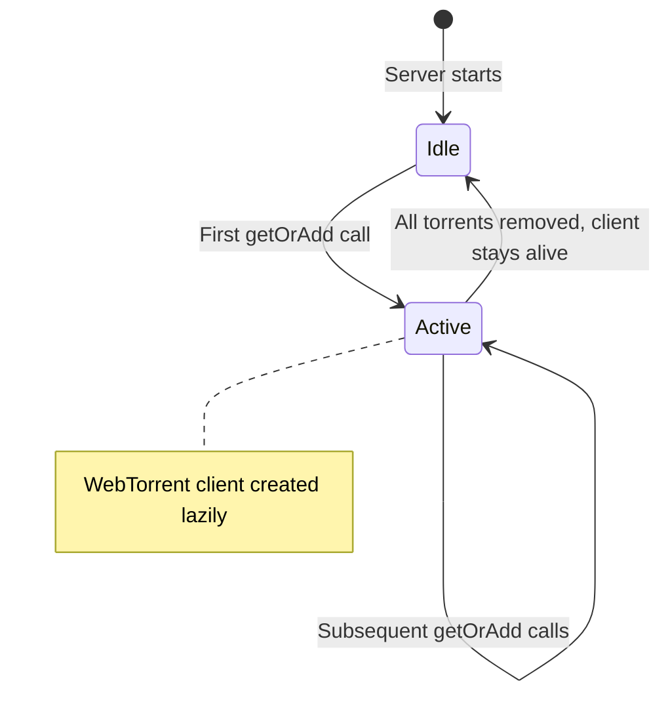

The WebTorrent client is created **lazily** on the first `getOrAdd()` call — not at server startup. This avoids unnecessary resource consumption when no streaming is active. Client settings:

| Setting | Value |
|---|---|
| `maxConns` | 50 per torrent |
| `utp` | Enabled (µTP, UDP-based) |
| `dht` | Enabled (distributed hash table) |
| `tracker` | Enabled (announces to tracker list) |

### Torrent Activation

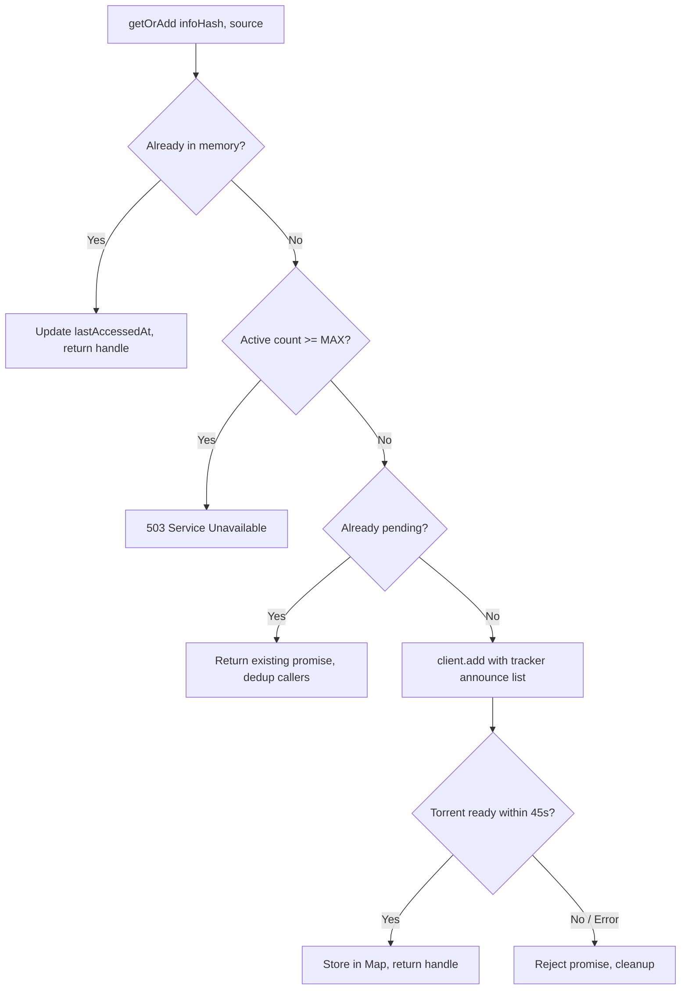

**Three data structures** track state:

| Map | Key | Purpose |
|---|---|---|
| `torrents` | `infoHash` → `TorrentHandle` | Active, ready-to-stream torrents |
| `pending` | `infoHash` → `Promise` | In-flight additions (deduplicates concurrent requests for the same torrent) |

**Source resolution priority:** The `source` parameter determines how WebTorrent finds peers:

1. **`.torrent` file (Buffer)** — fastest; contains tracker URLs + piece hashes
2. **Magnet URI (string)** — needs DHT/tracker to resolve metadata first
3. **No source** — constructs `magnet:?xt=urn:btih:{infoHash}` as fallback

The engine injects a hardcoded announce list (HTTPS + UDP trackers) to improve peer discovery reliability.

### Peer Discovery

After a torrent is added, the engine waits for the `ready` event (metadata + at least one piece available). A separate `waitForPeers()` method is used during streaming:

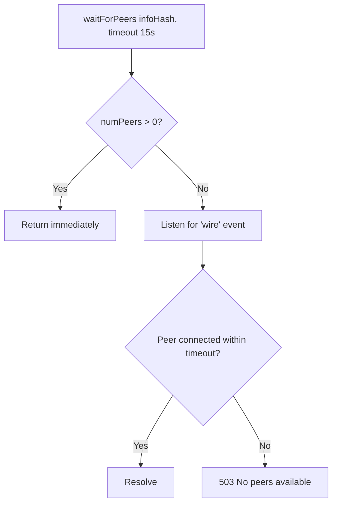

The `wire` event fires when a TCP/µTP connection to a peer is established — this is the earliest signal that data transfer can begin.

### Idle Cleanup

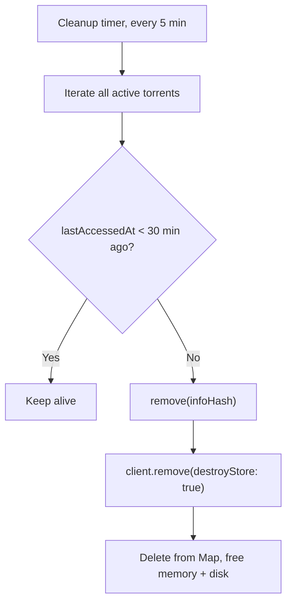

Each `TorrentHandle` tracks `lastAccessedAt` (updated on every `getOrAdd` or `getFile` call). The cleanup job:

- Runs on a `setInterval` with `.unref()` so it doesn't prevent Node.js from exiting
- Calls `client.remove()` with `destroyStore: true` to free both memory and any temporary disk storage
- Errors during cleanup are logged but don't crash the process

### Concurrency & Limits

| Parameter | Default | Env Override |
|---|---|---|
| Max concurrent torrents | 20 | `MAX_CONCURRENT_TORRENTS` |
| Max torrent size | 10 GB | `MAX_TORRENT_SIZE_GB` |
| Peer discovery timeout (add) | 45 s | Hardcoded |
| Peer wait timeout (stream) | 15 s | Hardcoded |
| Idle cleanup interval | 5 min | Hardcoded |
| Idle threshold | 30 min | Hardcoded |

When `activeCount() >= maxConcurrent`, new `getOrAdd()` calls immediately return **503 Service Unavailable** — no queuing.

---

## Stream Module

**Location:** `src/modules/stream/`

Bridges the gap between the TorrentEngine and the client's `<video>` element. Two endpoints work together:

| Endpoint | Purpose |
|---|---|
| `GET /api/torrents/:id/stream` | Mint a stream token + return file list |
| `GET /api/stream/:streamToken/:fileIndex` | Pipe video bytes to the client |

### Stream Session Flow

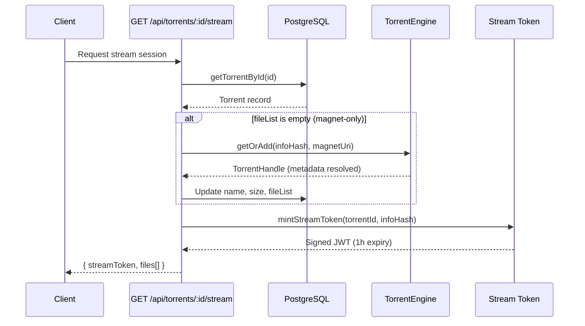

The session endpoint is the **only place** where magnet-only torrents get their metadata resolved. Once resolved, the `fileList` is persisted to the DB so subsequent requests skip engine activation.

### Token Security

Stream tokens are JWTs signed with a **separate secret** (`STREAM_TOKEN_SECRET`) from the auth JWT:

| Property | Value |
|---|---|
| Algorithm | HS256 (default jsonwebtoken) |
| Expiry | 1 hour (configurable via `STREAM_TOKEN_EXPIRY`) |
| Payload | `{ torrentId, infoHash }` |
| Secret | `STREAM_TOKEN_SECRET` (independent from `JWT_SECRET`) |

The token is embedded directly in the video URL (`/api/stream/{token}/{fileIndex}`), making it work with the browser's native `<video>` element which can't set custom headers.

### Video Delivery Pipeline

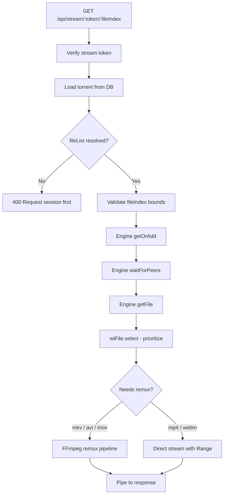

### Range Request Handling

For natively supported formats (`.mp4`, `.webm`), the stream endpoint implements full HTTP Range request support. This enables seeking in the video player.

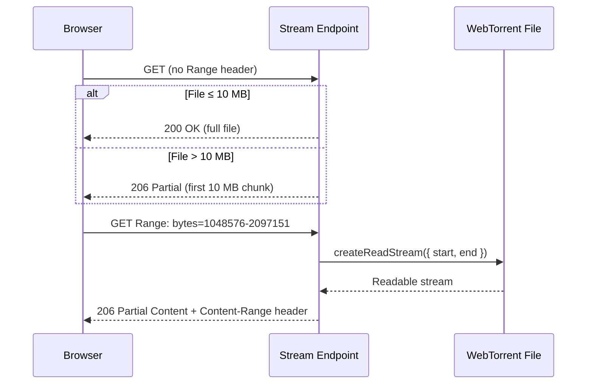

**Key implementation details:**

- **Max chunk size:** 10 MB per response — caps memory usage per concurrent request
- **Open-ended ranges** (`bytes=X-`): clamped to `start + 10MB - 1`
- **No Range header:** returns first 10 MB as 206 if file exceeds chunk limit
- **Validation:** rejects malformed ranges, out-of-bounds starts, and `start > end`
- `Content-Type` is set based on extension: `video/mp4` (default) or `video/webm`

### FFmpeg Remuxing

Formats that browsers can't natively play (`.mkv`, `.avi`, `.mov`) are **remuxed** (container-swapped) to MP4 on-the-fly:

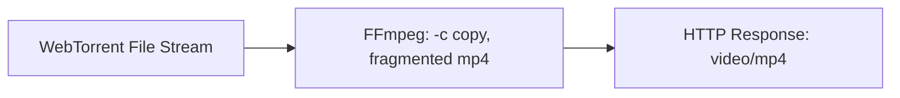

| Aspect | Detail |
|---|---|
| **Transcoding?** | No — `copy` codecs, container swap only |
| **Latency** | Minimal; `frag_keyframe+empty_moov` enables streaming without writing a full moov atom first |
| **Range support** | Disabled (`Accept-Ranges: none`) — can't seek within a remuxed stream |
| **Error handling** | FFmpeg errors are logged; if headers not yet sent, responds with 500 |
| **Pipe direction** | `wtFile.createReadStream()` → FFmpeg stdin → FFmpeg stdout → `res` |

The `frag_keyframe+empty_moov` movflags are critical: standard MP4 requires the moov atom (file index) at the beginning, which isn't available when streaming from a torrent. Fragmented MP4 writes self-contained fragments that can be played as they arrive.

---

## End-to-End Request Flow

Complete lifecycle from user action to video playback:

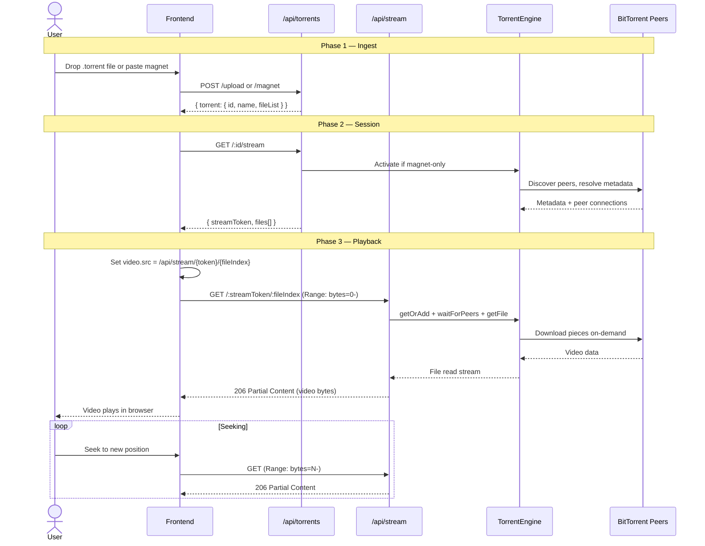

---

## Rate Limiting

All torrent and stream endpoints are rate-limited per IP:

| Endpoint | Window | Max Requests |
|---|---|---|
| `POST /api/torrents/upload` | 1 hour | 10 |
| `POST /api/torrents/magnet` | 1 hour | 10 |
| `GET /api/torrents/:id` | 1 hour | 120 |
| `GET /api/torrents/:id/stream` | 1 hour | 60 |
| `GET /api/stream/:token/:fileIndex` | 1 hour | 200 |

Rate limit headers (`RateLimit-*`) are included in responses per the IETF draft standard.

---

## Running Locally

```bash
# 1. Install dependencies
npm install

# 2. Copy and fill env
cp .env.example .env

# 3. Start PostgreSQL + Redis
docker compose up -d

# 4. Run migrations + generate Prisma client
npm run prisma:mig
npm run prisma:gen

# 5. Start dev server (tsx watch, auto-reload)
npm run dev
# → http://localhost:3001
```

**Prerequisites:** Node.js 20+, FFmpeg in PATH (required for mkv/avi/mov remuxing), Docker (for PostgreSQL + Redis).
